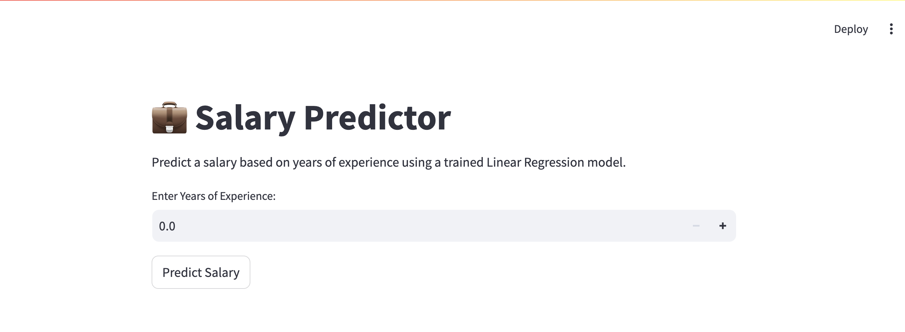

# 💼 Salary Predictor Web App

A simple interactive web app that predicts **salary based on years of experience** using a **Linear Regression model** trained with Python. Built using **Flask**.

## 📸 Screenshot

Here’s how the app looks in action:




---

## 🚀 Features

- 📈 Predict salary based on experience
- 🔍 Uses trained Linear Regression model
- ⚙️ Built with Flask & Scikit-learn
- 🧠 Pre-trained model loaded via Joblib

---

## 🧰 Tech Stack

- Python 🐍
- Flask 🌶️ / Streamlit 
- Scikit-learn 🤖
- HTML (Jinja2 templates) 🌐
- Joblib for model serialization 💾

---

## 🛠️ Setup Instructions

### 1. Clone the Repository

```bash
git clone https://github.com/yourusername/salary-predictor.git
cd salary-predictor


# 📦 Model Info
Trained on Salary_Data.csv

Simple Linear Regression

R² Score ≈ 0.975 (Excellent Fit 🎯)

# 🎯 Future Ideas
✅ Switch to Streamlit for easier UI

🔢 Add more input features (education, role, location)